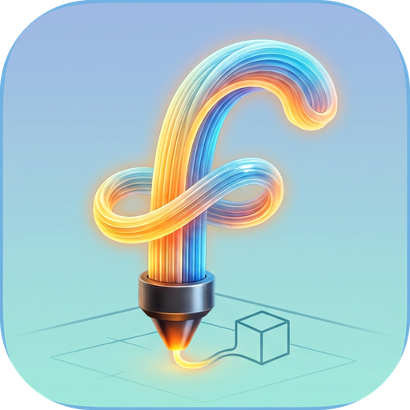
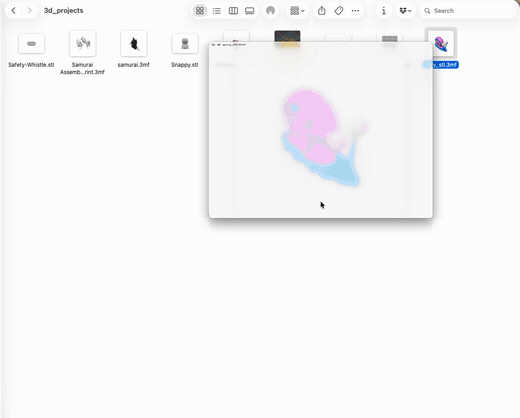
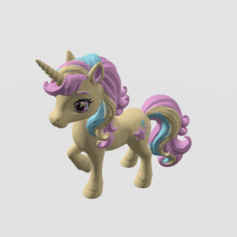

<p align="center">
  
</p>

<h1 align="center">Filament</h1>

<p align="center">
  Una aplicación nativa de Quick Look para macOS para archivos de impresión 3D y modelos 3D.<br>
  Selecciona un archivo en Finder, presiona <b>Espacio</b> y obtén una vista previa interactiva en 3D: sin necesidad de un slicer.
</p>

<p align="center">
  <a href="https://github.com/akshaymaloo/filament/releases/latest"></a>
  
  <a href="https://ko-fi.com/akshaymaloo"></a>
  
  
</p>

<p align="center"><a href="README.md">English</a> · <b>Español</b></p>

---

### En acción

Presiona <b>Espacio</b> en Finder para obtener una vista previa de cualquier
archivo compatible, alterna entre color completo y un aspecto neutro de
estudio, y gira alrededor del modelo; luego ábrelo en pantalla completa en la
aplicación.

<p align="center">
  
</p>

## Descarga

**Recomendado — una sola línea, sin necesidad de Xcode.** Abre Terminal y
ejecuta:

```bash
curl -fsSL https://raw.githubusercontent.com/akshaymaloo/filament/main/scripts/install-release.sh | bash
```

Esto descarga la última versión, verifica su checksum, la instala en
`~/Applications` y registra las extensiones de Quick Look.

**Instalación manual:**

1. Descarga **Filament.dmg** desde la [última versión](https://github.com/akshaymaloo/filament/releases/latest)
   y arrastra Filament a Aplicaciones.
2. Abre Filament. Como la compilación aún no está notarizada, macOS bloquea
   el primer inicio: ve a **Ajustes del Sistema › Privacidad y Seguridad** y
   haz clic en **Abrir de todos modos** (o ejecuta
   `xattr -dr com.apple.quarantine /Applications/Filament.app`).
3. Abrir la aplicación una vez registra sus extensiones de Quick Look con
   Finder.

Las compilaciones funcionan en Mac con **Apple silicon e Intel**, macOS 14 o
posterior. Notarizar las versiones requiere una cuenta de pago de Apple
Developer — si Filament te resulta útil,
[apoyarlo en Ko-fi](https://ko-fi.com/akshaymaloo) ayuda a lograrlo.

## Formatos compatibles y funciones

Filament añade **miniaturas en Finder** y **vistas previas interactivas de
Quick Look** (órbita, desplazamiento, zoom, iluminación suave de estudio)
para:

- **`.3mf`** — Formato de Manufactura 3D, incluidos archivos de proyecto de
  Bambu Studio / OrcaSlicer: múltiples placas, miniaturas de placas
  incrustadas, estadísticas de impresión y la **Extensión de Producción** de
  3MF donde la geometría reside en partes externas del modelo.
- **`.stl`** — binario y ASCII.
- **`.obj`** — Wavefront OBJ.
- **`.ply`** — ASCII y binario (little/big endian).

<p align="center">
  
</p>
<p align="center"><sub>Los modelos 3MF multimaterial se renderizan con sus colores reales de filamento.</sub></p>

- **Miniaturas instantáneas.** Para 3MF se usa la imagen de placa incrustada
  por el slicer para un icono casi instantáneo; STL/OBJ/PLY se renderizan
  sobre la marcha.
- **Multimaterial a todo color.** Los modelos 3MF de Bambu/Orca pintados con
  múltiples filamentos se renderizan con sus colores reales del slicer;
  alterna a un aspecto monocromático neutro de estudio.
- **Explora todas las placas de construcción.** Los proyectos 3MF con
  múltiples placas obtienen un selector de placas.
- **Información del modelo.** Dimensiones (W × D × H mm) y cantidad de
  triángulos; tiempo de impresión, peso e impresora para 3MF.
- **Abrir en la aplicación.** Haz doble clic en un archivo compatible (o
  arrastra y suelta) para abrirlo en la ventana de Filament; arrastra otro
  archivo para cambiar el modelo al instante.
- **Rápido con modelos grandes.** Un analizador 3MF de flujo dedicado abre
  archivos de millones de triángulos en aproximadamente un segundo.
- **Atajos de teclado.** Abrir (⌘O), Recargar (⌘R), Revelar en Finder (⇧⌘R) y
  Cerrar archivo (⌘W).
- **Abre por defecto.** `install.sh` establece Filament como la aplicación
  predeterminada para `.3mf` y `.stl` (omítelo con `--no-defaults`). Con la
  versión descargada, selecciona un archivo en Finder, pulsa ⌘I y elige
  **Abrir con › Filament › Cambiar todo**.
- **Respetuoso con la privacidad y fuera de línea.** Todo se ejecuta
  localmente: sin red, sin telemetría.

### Vistas previas de STL / OBJ / PLY en macOS 26+

macOS 26 incluye su propia extensión de Quick Look 3D
(`com.apple.HydraQLPreviewExtension`), que reclama STL, OBJ y PLY y siempre
tiene prioridad sobre las extensiones de terceros. Por eso, de forma
predeterminada Apple muestra esos formatos y Filament muestra 3MF. Para usar
Filament con todos ellos:

```bash
# instalador de una línea
curl -fsSL https://raw.githubusercontent.com/akshaymaloo/filament/main/scripts/install-release.sh | bash -s -- --prefer-filament-stl
curl -fsSL https://raw.githubusercontent.com/akshaymaloo/filament/main/scripts/install-release.sh | bash -s -- --restore-apple-stl   # deshacer

# o, compilando desde el código fuente
./install.sh --prefer-filament-stl
./install.sh --restore-apple-stl     # deshacer
```

Esto ejecuta `pluginkit -e ignore -i com.apple.HydraQLPreviewExtension`, un
ajuste por usuario y reversible que no modifica archivos del sistema.
Mientras está activo, los archivos USD / MaterialX / Alembic usan la vista
previa genérica de SceneKit de Apple. Desinstalar restaura automáticamente la
vista previa de Apple.

> Si las vistas previas con la barra espaciadora no aparecen justo después de
> instalar, cierra y vuelve a iniciar sesión una vez para que Finder recargue
> las extensiones de Quick Look.

## Hoja de ruta

El trabajo planificado se rastrea en
[Issues](https://github.com/akshaymaloo/filament/issues) — se aceptan
solicitudes de funciones.

## Solución de problemas

### STL/OBJ/PLY se abren en la vista previa de Apple en lugar de Filament

Es la vista previa Hydra integrada de Apple en macOS 26+. Consulta
[Vistas previas de STL / OBJ / PLY en macOS 26+](#vistas-previas-de-stl--obj--ply-en-macos-26)
más arriba.

### Quick Look muestra un archivo genérico en lugar de la vista previa 3D de un 3MF

Puede que otra app haya registrado su propio UTI para `.3mf`. Las extensiones
de Filament reclaman los más comunes (incluido `com.shapr3d.3d-manufacturing.3mf`
de Shapr3D). Si las vistas previas siguen sin aparecer:

1. Reinstala (o cierra sesión y vuelve a entrar) para que Launch Services y
   Quick Look se recarguen.
2. Confirma que las extensiones están registradas: `pluginkit -m | grep -i filament`
3. Comprueba el tipo del archivo: `mdls -name kMDItemContentType el-archivo.3mf`

Si ves un identificador que Filament no incluye,
[abre un issue](https://github.com/akshaymaloo/filament/issues) con ese UTI.

### Algunos archivos 3MF no se abren (OnShape y similares)

El lector ZIP de Filament entiende los campos extra Zip64, incluidos los
archivos que ponen centinelas `0xFFFFFFFF` en todos los tamaños/desplazamientos
del directorio central aunque el archivo sea pequeño (el exportador de
OnShape lo hace). Si un archivo sigue sin abrirse, adjúntalo a un issue.

### Un modelo muy grande muestra un icono genérico en Finder

Las miniaturas de Finder se generan con un límite de 3 millones de triángulos
y unos 20 segundos, para que un modelo enorme no bloquee Finder. Por encima
de eso, un 3MF con una miniatura incrustada por el slicer sigue mostrando esa
imagen; los demás archivos usan el icono predeterminado. La vista previa con
la barra espaciadora abre modelos de hasta 20 millones de triángulos, y la
app Filament admite modelos aún más grandes.

## Compilar desde el código fuente

Compilar desde el código fuente requiere **Xcode 15 o posterior** y
**[XcodeGen](https://github.com/yonaskolb/XcodeGen)** (`brew install xcodegen`);
el proyecto de Xcode se genera desde `project.yml` y no está incluido en el
repositorio.

```bash
git clone https://github.com/akshaymaloo/filament.git
cd filament
./install.sh
```

`install.sh` verifica los prerrequisitos (Xcode y XcodeGen — instalados vía
Homebrew si es necesario), genera el proyecto de Xcode, compila una versión
Release, **la firma para ejecución local** (no se requiere cuenta de Apple
Developer), la instala en `~/Applications` y registra las extensiones de
Quick Look. Para firmar con tu propio equipo de Apple Developer en su lugar,
pasa `DEVELOPMENT_TEAM`:

```bash
DEVELOPMENT_TEAM=ABCDE12345 ./install.sh
```

Desinstala en cualquier momento con `./install.sh --uninstall`.

<details>
<summary>Compilar en Xcode (manual)</summary>

#### 1. Clonar y generar el proyecto

```bash
git clone https://github.com/akshaymaloo/filament.git
cd filament
brew install xcodegen      # si no lo tienes
xcodegen generate          # crea Filament.xcodeproj
open Filament.xcodeproj
```

#### 2. Establecer un equipo de firma

macOS solo carga una **extensión de aplicación de Quick Look** si la
aplicación contenedora está firmada y registrada en Launch Services. En
Xcode:

1. Selecciona el proyecto **Filament** en el navegador.
2. Para **cada** uno de los tres objetivos — `Filament`, `ThumbnailExtension`,
   `PreviewExtension` — abre **Firma y Capacidades** y selecciona tu
   **Equipo**. La firma está preconfigurada como *Automática*; solo debes
   elegir el equipo.
   - No se requiere una cuenta de pago de Apple Developer: iniciar sesión en
     Xcode con una Apple ID gratuita te da un **Equipo Personal** que funciona
     para uso local.
   - Alternativamente, configura el certificado de firma en **"Firmar para
     ejecutar localmente"** (ad-hoc) para ejecutarlo en tu propio Mac sin
     ninguna Apple ID.

El prefijo del identificador de paquete es `com.filament3d` (p. ej.
`com.filament3d.Filament`). Cámbialo por tu propio identificador DNS inverso
si planeas distribuir la aplicación.

#### 3. Compilar y ejecutar una vez

Compila y ejecuta el objetivo de la aplicación **Filament** (⌘R) al menos una
vez. Lanzar la aplicación registra sus extensiones de Quick Look incrustadas
en el sistema.

Para una integración en Finder a nivel del sistema, mueve la aplicación
compilada a `/Applications` (o `~/Applications`) y lánzala una vez desde
allí.

#### 4. Verificar Quick Look

```bash
# Reinicia el daemon de Quick Look para que recoja las extensiones recién registradas
qlmanage -r
qlmanage -r cache

# Confirma que las extensiones están registradas
pluginkit -m | grep -i filament
```

Luego selecciona un archivo `.3mf`, `.stl`, `.obj` o `.ply` en Finder y
presiona **Espacio** para la vista previa, o visualízalo en una ventana de
vista de iconos para la miniatura.

</details>

<details>
<summary>Compilación por línea de comandos (CI / sin firma)</summary>

Para verificar que la aplicación y ambas extensiones se compilan y enlazan
**sin** una identidad de firma (p. ej., en un ejecutor de CI):

```bash
export DEVELOPER_DIR=/Applications/Xcode.app/Contents/Developer
xcodegen generate
xcodebuild build \
  -project Filament.xcodeproj -scheme Filament \
  -destination 'platform=macOS' -configuration Debug \
  CODE_SIGNING_ALLOWED=NO
```

Compilar el esquema `Filament` también compila ambas extensiones incrustadas
(son dependencias del objetivo). Esto produce un `.app` sin firma apto solo
para verificación de compilación/enlace: no registrará sus extensiones de
Quick Look a nivel del sistema.

</details>

## Desarrollo

`ThreeMFKit` es un paquete Swift sin dependencias y puede compilarse y
probarse únicamente con la herramienta Swift:

```bash
swift build                     # compila la biblioteca
swift run three-mf-validate     # suite de validación autocontenida (sin XCTest)
swift test                      # XCTest: análisis, fixtures de referencia, renderizado y rendimiento
swift test --enable-code-coverage && scripts/check-coverage.sh   # falla por debajo del 85% de cobertura
```

### Arquitectura

- **`ThreeMFKit`** (`Sources/ThreeMFKit`) — núcleo sin dependencias: lector
  ZIP de solo lectura (vía el framework `Compression`), análisis XML de
  OPC / 3MF incluida la Extensión de Producción, análisis de mallas
  STL/OBJ/PLY, una fachada `ModelLoader` que distribuye por tipo de archivo,
  extracción de placas/miniaturas/estadísticas y construcción de escenas
  SceneKit (`ModelSCNView`, cámaras, iluminación, sombras).
- **`Filament`** (`App/Filament`) — la aplicación host de SwiftUI. Abre o
  recibe por arrastre un archivo de modelo y explora las placas de
  construcción de forma interactiva. Declara el UTI personalizado
  `com.filament3d.3mf` e incrusta ambas extensiones de Quick Look.
- **`ThumbnailExtension`** (`Extensions/ThumbnailExtension`) — una extensión
  de aplicación `QLThumbnailProvider` para miniaturas de Finder/Spotlight.
- **`PreviewExtension`** (`Extensions/PreviewExtension`) — una extensión de
  aplicación `QLPreviewingController` para el panel completo de vista previa
  con barra espaciadora.

### Identificadores de Tipo Uniforme

- `com.filament3d.3mf` — tipo importado personalizado para `.3mf` (cumple con
  `public.data` y `public.3d-content`, MIME `model/3mf`).
- STL/OBJ/PLY usan los tipos declarados por el sistema
  `public.standard-tesselated-geometry-format`,
  `public.geometry-definition-format` y `public.polygon-file-format`.

3MF no tiene un UTI definido por Apple, así que otras apps (Shapr3D, Bambu
Studio, Cadova, …) declaran su propio identificador para `.3mf`. Launch
Services resuelve entonces esos archivos a *ese* UTI, y Quick Look no invoca
a Filament a menos que las extensiones también lo reclamen. Por eso las
extensiones de vista previa y miniaturas incluyen los UTI de 3MF de terceros
más comunes en `QLSupportedContentTypes`, además de `com.filament3d.3mf`.

### Publicar una versión

1. Incrementa `MARKETING_VERSION` en `project.yml`.
2. Opcionalmente añade notas de la versión en `docs/release-notes/vX.Y.Z.md`.
3. Publica una etiqueta: `git tag vX.Y.Z && git push origin vX.Y.Z`.

`.github/workflows/release.yml` compila entonces un `Filament.app` universal
y firmado ad-hoc, lo empaqueta en `Filament.zip` / `Filament.dmg` /
`SHA256SUMS.txt`, y abre una versión de GitHub en **borrador** para revisión.

## Contribuciones

Las issues y pull requests son bienvenidas. Por favor, mantén `ThreeMFKit`
sin dependencias y asegúrate de que `swift run three-mf-validate` y
`swift build` pasen antes de abrir un PR (CI ejecuta esto más una
compilación de Xcode en cada push).

## Soporte

Filament es gratuita y de código abierto. Si la encuentras útil, puedes
apoyar su desarrollo:

<a href="https://ko-fi.com/akshaymaloo"></a>

Hoy las versiones están **firmadas de forma ad hoc "para ejecución local"**,
por lo que macOS muestra una advertencia de Gatekeeper en el primer inicio.
Las donaciones van destinadas a una membresía del **Apple Developer Program**
para que futuras versiones puedan ser **notarizadas** — sin advertencias de
Gatekeeper — y, eventualmente, publicadas en la **Mac App Store**. ¡Gracias! 🙏

## Licencia

Publicada bajo la [Licencia MIT](LICENSE).
