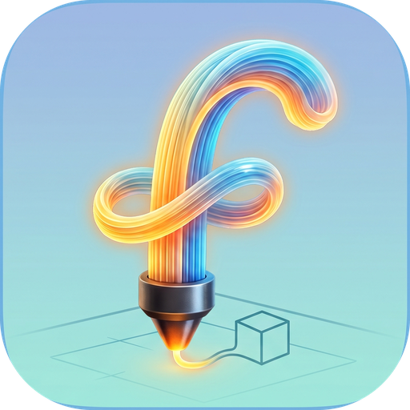
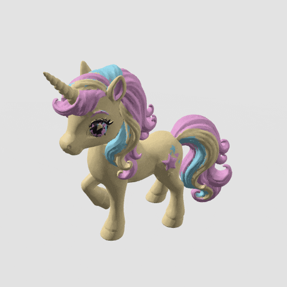
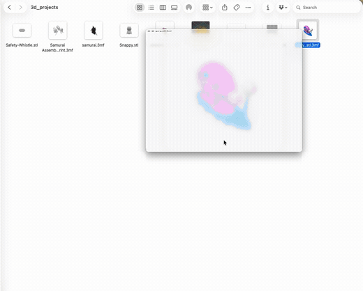

<p align="center">
  
</p>

<h1 align="center">Filament</h1>

<p align="center">
  A native macOS Quick Look app for 3D-printing and 3D-model files.<br>
  Select a file in Finder, press <b>Space</b>, and get an interactive 3D preview — no slicer required.
</p>

<p align="center">
  <a href="https://ko-fi.com/akshaymaloo"></a>
  
  
</p>

---

<p align="center">
  
</p>
<p align="center"><sub>Multi-material 3MF models render in their real filament colors, with an interactive turntable preview rendered by Filament's Quick Look extension.</sub></p>

### See it in action

Press <b>Space</b> in Finder to preview any supported file, toggle between full
color and a neutral studio look, and orbit the model — then open it full-screen
in the app.

<p align="center">
  
</p>

Filament adds **thumbnails** and **interactive Quick Look previews** for:

- **`.3mf`** — 3D Manufacturing Format, including Bambu Studio / OrcaSlicer
  project files (multi-plate, embedded plate thumbnails, print stats, and the
  3MF **Production Extension** where geometry lives in external model parts).
- **`.stl`** — binary and ASCII.
- **`.obj`** — Wavefront OBJ.
- **`.ply`** — ASCII and binary (little/big endian).

## Features

- **Instant Finder thumbnails.** For 3MF, the slicer-embedded plate image is
  used for a near-instant icon; STL/OBJ/PLY are rendered on the fly.
- **Interactive preview.** Press Space in Finder for a SceneKit preview with
  orbit, pan, and zoom, and soft studio lighting.
- **Full-color multi-material.** Bambu/Orca 3MF models painted with multiple
  filaments render in their real slicer colors; toggle between color and a
  neutral monochrome studio look.
- **Browse all build plates.** Multi-plate 3MF projects get a plate selector.
- **Model info.** Dimensions (W × D × H mm) and triangle count; print time,
  weight, and printer for 3MF.
- **Open in the app.** Double-click a supported file (or drag-and-drop) to open
  it in the Filament window. Drag another file in to swap the model instantly.
- **Fast on big models.** A dedicated streaming 3MF parser opens multi-million-
  triangle files in about a second.
- **Keyboard shortcuts.** Open (⌘O), Reload (⌘R), Reveal in Finder (⇧⌘R), and
  Close File (⌘W).
- **Default opener.** `install.sh` makes Filament the default app for `.3mf`
  and `.stl` (overriding Preview for STL); opt out with `--no-defaults`.
- **Privacy-friendly & offline.** Everything runs locally — no network, no
  telemetry.

## Requirements

- **macOS 14.0 (Sonoma) or later.**
- To build: **Xcode 15 or later** and **[XcodeGen](https://github.com/yonaskolb/XcodeGen)**
  (`brew install xcodegen`).
- To run the Quick Look extensions in Finder you need to **code-sign** the app
  (a free Apple ID works — see below).

## Build & install

### Quick install (one command)

```bash
git clone https://github.com/<your-org-or-user>/filament.git
cd filament
./install.sh
```

`install.sh` checks prerequisites (Xcode, and XcodeGen — installed via Homebrew
if needed), generates the Xcode project, builds a Release, **signs it to run
locally** (no Apple Developer account required), installs it to
`~/Applications`, and registers the Quick Look extensions. To build and sign
with your own Apple Developer team instead, pass `DEVELOPMENT_TEAM`:

```bash
DEVELOPMENT_TEAM=ABCDE12345 ./install.sh
```

Uninstall any time with `./install.sh --uninstall`.

> If Space-bar previews don't show up right after install, log out and back in
> once so Finder reloads the Quick Look extensions.

### Build in Xcode (manual)

The Xcode project is generated from `project.yml` by XcodeGen (it is not checked
in), so the first step is always to generate it.

#### 1. Clone and generate the project

```bash
git clone https://github.com/<your-org-or-user>/filament.git
cd filament
brew install xcodegen      # if you don't have it
xcodegen generate          # creates Filament.xcodeproj
open Filament.xcodeproj
```

#### 2. Set a signing team

macOS only loads a Quick Look **app extension** if the containing app is
code-signed and registered with Launch Services. In Xcode:

1. Select the **Filament** project in the navigator.
2. For **each** of the three targets — `Filament`, `ThumbnailExtension`,
   `PreviewExtension` — open **Signing & Capabilities** and pick your
   **Team**. Signing is preconfigured as *Automatic*; you only choose the team.
   - No paid Apple Developer account is required: signing in to Xcode with a
     free Apple ID gives you a **Personal Team** that works for local use.
   - Alternatively, set the signing certificate to **“Sign to Run Locally”**
     (ad-hoc) to run on your own Mac without any Apple ID.

The bundle identifier prefix is `com.filament3d` (e.g.
`com.filament3d.Filament`). Change it to your own reverse-DNS identifier if you
plan to distribute the app.

#### 3. Build & run once

Build and run the **Filament** app target (⌘R) at least once. Launching the app
registers its embedded Quick Look extensions with the system.

For system-wide Finder integration, move the built app to `/Applications` (or
`~/Applications`) and launch it once from there.

#### 4. Verify Quick Look

```bash
# Reset the Quick Look daemon so it picks up the newly registered extensions
qlmanage -r
qlmanage -r cache

# Confirm the extensions are registered
pluginkit -m | grep -i filament
```

Then select a `.3mf`, `.stl`, `.obj`, or `.ply` file in Finder and press
**Space** for the preview, or view it in an icon-view window for the thumbnail.

## Command-line build (CI / no signing)

To verify the app and both extensions compile and link **without** a signing
identity (e.g. on a CI runner):

```bash
export DEVELOPER_DIR=/Applications/Xcode.app/Contents/Developer
xcodegen generate
xcodebuild build \
  -project Filament.xcodeproj -scheme Filament \
  -destination 'platform=macOS' -configuration Debug \
  CODE_SIGNING_ALLOWED=NO
```

Building the `Filament` scheme also builds both embedded extensions (they are
target dependencies). This produces an unsigned `.app` suitable for
compile/link verification only — it will not register its Quick Look extensions
system-wide.

## Development

`ThreeMFKit` is a dependency-free Swift package and can be built and tested with
the Swift toolchain alone:

```bash
swift build                 # build the library
swift run three-mf-validate # self-contained validation suite (no XCTest needed)
swift test                  # XCTest suite (requires a full Xcode toolchain)
```

## Architecture

- **`ThreeMFKit`** (`Sources/ThreeMFKit`) — dependency-free core: a read-only
  ZIP reader (via the `Compression` framework), OPC / 3MF XML parsing including
  the Production Extension, STL/OBJ/PLY mesh parsing, a `ModelLoader` facade
  that dispatches by file type, plate/thumbnail/stat extraction, and SceneKit
  scene construction (`ModelSCNView`, cameras, lighting, shadows).
- **`Filament`** (`App/Filament`) — the SwiftUI host app. Opens or drops a
  model file and browses build plates interactively. Declares the custom
  `com.filament3d.3mf` UTI and embeds both Quick Look extensions.
- **`ThumbnailExtension`** (`Extensions/ThumbnailExtension`) — a
  `QLThumbnailProvider` app extension for Finder/Spotlight thumbnails.
- **`PreviewExtension`** (`Extensions/PreviewExtension`) — a
  `QLPreviewingController` app extension for the full Space-bar preview panel.

### Uniform Type Identifiers

- `com.filament3d.3mf` — custom imported type for `.3mf` (conforms to
  `public.data` and `public.3d-content`, MIME `model/3mf`).
- STL/OBJ/PLY use the system-declared types
  `public.standard-tesselated-geometry-format`,
  `public.geometry-definition-format`, and `public.polygon-file-format`.

## Contributing

Issues and pull requests are welcome. Please keep `ThreeMFKit` dependency-free,
and make sure `swift run three-mf-validate` and `swift build` pass before
opening a PR (CI runs these plus an Xcode build on every push).

## Support

Filament is free and open source. If you find it useful, you can support its
development:

<a href="https://ko-fi.com/akshaymaloo"></a>

Today the app is **ad-hoc "signed to run locally"**, so you build it yourself
with `install.sh`. Donations go toward an **Apple Developer Program** membership
so future releases can be **notarized** — no Gatekeeper warnings and a
ready-to-run download — and, eventually, published on the **Mac App Store**.
Thank you! 🙏

## License

Released under the [MIT License](LICENSE).
